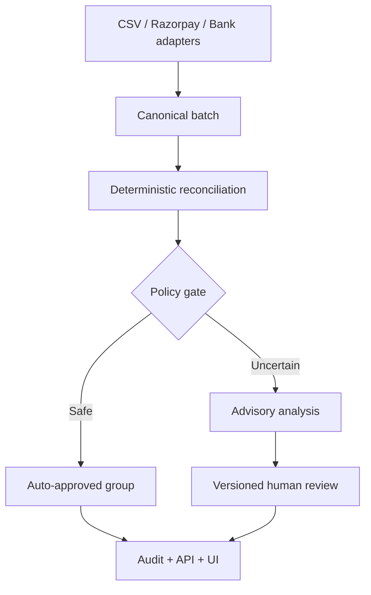
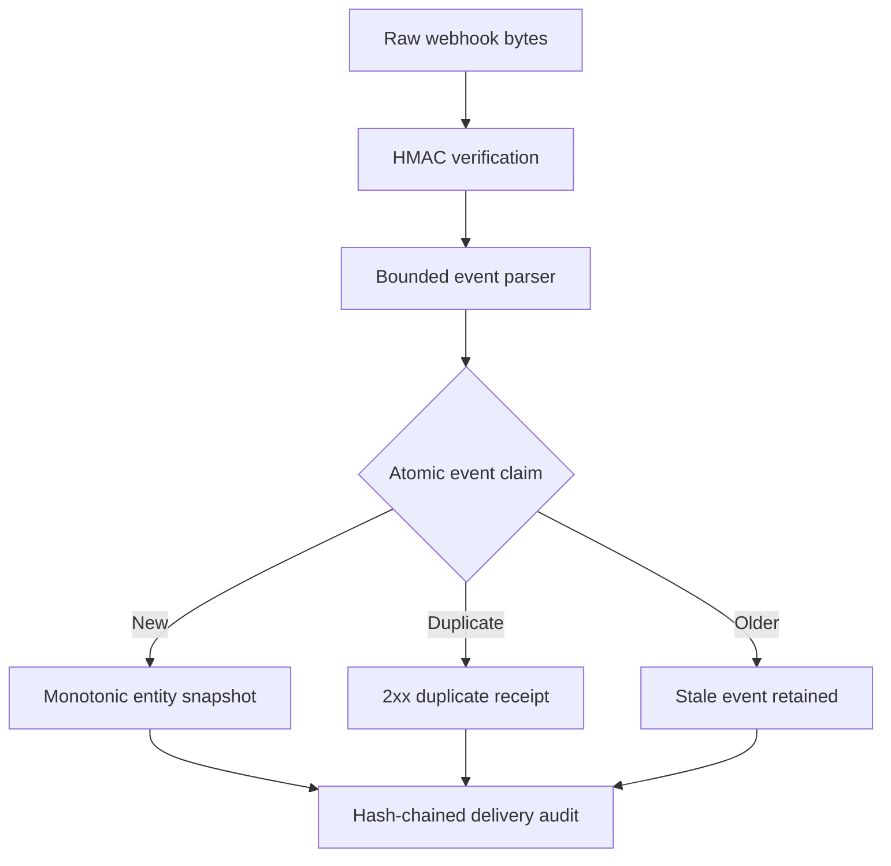

# Architecture

ReconX uses a ports-and-adapters architecture. The domain and application layers use
only the Python standard library and never import FastAPI, databases, Razorpay SDKs,
dataframe packages or model providers.

## Accounting invariant

Razorpay reports `fee` inclusive of GST and reports `tax` as the GST component.
Therefore:

`expected bank credit = captured payment gross - processed refunds - fee + adjustments`

Tax is validated with `0 <= tax <= fee`; it is not subtracted twice.

## Decision authority

The deterministic core owns money truth, invariant checks and automatic-approval
state. The AI adapter may classify and explain an exception, but cannot mutate source
records, calculate final amounts, use tools or bypass policy thresholds. A model
response is accepted only when it matches the exact schema and cites only case-owned
evidence IDs. Provider failure produces a deterministic classification.

Human decisions are separate, explicit state transitions. Each request supplies the
case version to prevent stale browser decisions. Approval, rejection and reopening
append hash-linked events; history is not rewritten. Phase 3 records the review
decision but deliberately does not post an accounting entry.

## Replaceable boundaries

`AnalysisProvider` is a narrow outbound port. A hosted-model adapter can be added
without changing reconciliation or review policy. The in-memory review repository is
also a port-bound prototype and can be replaced by a transactional database in a
later phase. These boundaries let provider, storage and UI choices change without
rewriting the finance engine.

## Evaluation plane

The evaluation path is separate from the runtime decision path. A synthetic generator
produces raw records and a separately stored ground-truth object. The manifest binds
both inputs and the frozen policy contract with SHA-256. The evaluator verifies those
hashes before scoring the candidate and exact-ID baseline, then publishes all
non-auto-resolved groups. Wall-clock throughput is kept outside the deterministic
evidence hash because it varies by host.

## Razorpay delivery boundary

The request body is not decoded before signature verification. Event-id claims and
snapshot updates share one SQLite transaction. Entity projections use
`(event_created_at, event_id)` ordering, so the final state is independent of delivery
order even when timestamps tie. Raw payloads and customer contact fields are not
stored; the store retains a body hash and the minimum normalised finance fields.

The settlement-reconciliation client has a fixed Razorpay HTTPS endpoint, Basic API
authentication, a maximum five-second timeout and a bounded response. It is separate
from webhook secrets and remains unused unless explicitly called with credentials.
